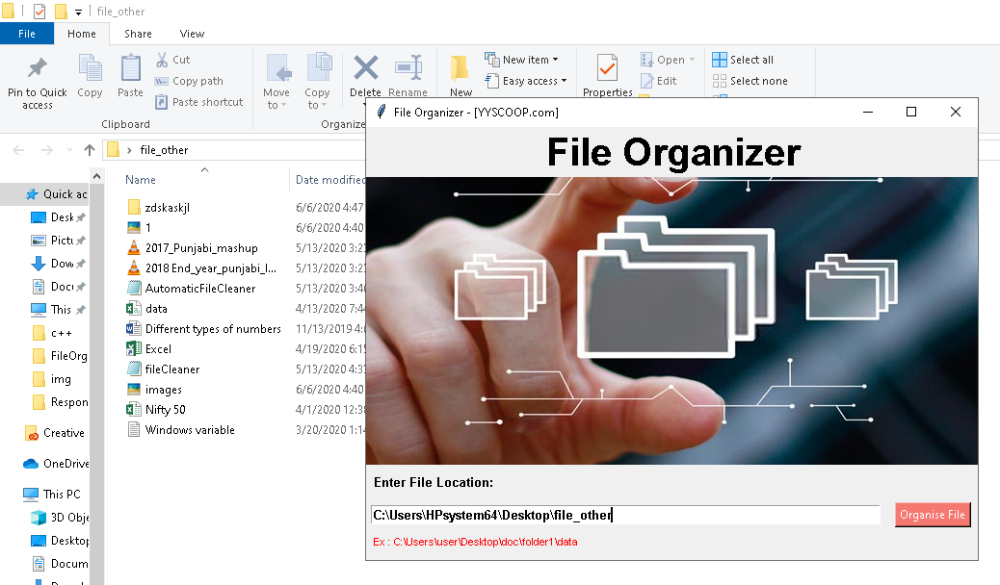

## fileOrganizer
> `fileOrganizer` is a utility that organises and manages files in a directory into subdirectories based on the file extensions.


## Usage

1. Open your Terminal/cmd

2. git clone this project to your preferred directory.

3. `cd File-Organizer`

4. `python FileOrganizer.py`

<br/>

or Execute:
```
ExecuteFileOrganizer.cmd
```

## Screenshots  

#### First:
</img>

#### Second:
</img>

## Installation
Set up a virtual environment and install the dependencies:
```sh
pip install -r requirements.txt
```

## License
This project is licensed under the terms of the [GPL-3.0 license](https://github.com/yogesh7132/File-Organizer/blob/master/LICENSE).
